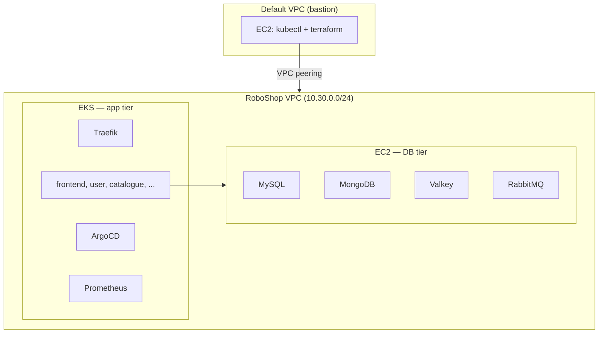

# RoboShop v2 — EKS + EC2 DB

Infrastructure for [RoboShop microservices](https://github.com/raghudevopsb88/roboshop-microservices-documentation): databases on EC2, applications on EKS, aligned with [wmp-terraform-encrypt-n-network-v9](https://github.com/raghudevopsb88/wmp-terraform-encrypt-n-network-v9) layout.

## Architecture



## Modules

| Module | Path | Purpose |
|--------|------|---------|
| **vpc** | `terraform/modules/vpc` | VPC, public/app/db subnets, NAT, IGW, **peering to default VPC** |
| **ec2** | `terraform/modules/ec2` | MySQL, MongoDB, Valkey, RabbitMQ on EC2 + private Route53 |
| **eks** | `terraform/modules/eks` | Production EKS, addons, platform Helm, app Helm |

## Prerequisites

- AWS CLI, Terraform >= 1.5, Helm, `kubectl`
- S3 backend bucket (see `terraform/environments/dev/state.tfvars`)
- KMS key ARN for EKS secrets + encrypted node volumes
- Bastion instance in **default VPC** (run `terraform` and `kubectl` from there)
- `labauto ansible` on DB AMIs (from your training AMI bootstrap)

## Quick start (dev)

1. Edit `terraform/environments/dev/main.tfvars`:
   - Set `kms_key_id`
   - Optionally `dns_domain` and `acm_certificate_arn` for Traefik NLB TLS

2. From bastion in default VPC:

```bash
cd terraform
make dev-apply
```

3. Verify:

```bash
aws eks update-kubeconfig --name dev --region us-east-1
kubectl get nodes
kubectl get pods -A
kubectl get pods -n roboshop
```

## Default VPC peering

Default VPC id, route table, and CIDR are discovered automatically (`data.aws_vpc.default`). Peering lets the bastion reach:

- Private EKS API (443)
- DB EC2 instances (SSH + DB ports)

## Helm

- **Platform** (Terraform): Traefik, cluster-autoscaler, external-dns, Argo CD, kube-prometheus-stack, metrics-server
- **Apps** (`helm/charts/*`): dummy images; replace before production

See [helm/README.md](helm/README.md).

## Security highlights

- Private EKS API only; HTTPS from default VPC CIDR
- KMS encryption for Kubernetes secrets and node EBS
- IMDSv2 required on nodes and DB instances
- EKS control plane logging to CloudWatch
- `eks-pod-identity-agent` + pod identity for external-dns and cluster-autoscaler
- Encrypted gp3 root volumes

## References

- [roboshop-v1](https://github.com/raghudevopsb88/roboshop-v1) — Ansible roles for DB bootstrap
- [roboshop-microservices-documentation](https://github.com/raghudevopsb88/roboshop-microservices-documentation) — service ports and artifacts
